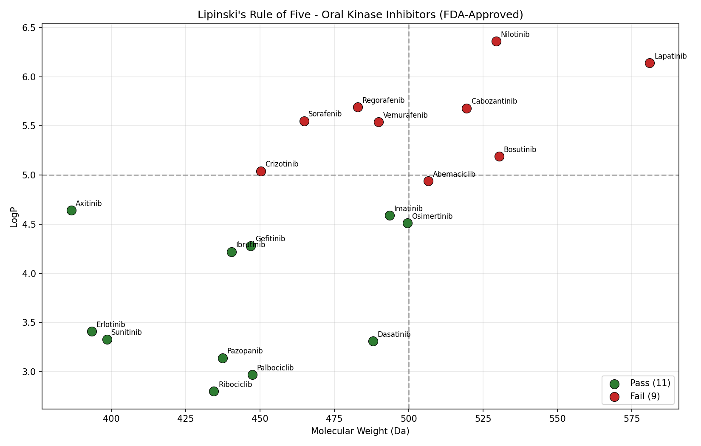

# RSK & Oral Kinase Inhibitor Druglikeness Screen

A cheminformatics tool that evaluates 20 FDA-approved oral kinase
inhibitors used in cancer therapy against **Lipinski's Rule of Five** — the
standard medicinal chemistry filter for predicting oral bioavailability.

## Motivation

Oral small-molecule kinase inhibitors (e.g. imatinib, palbociclib, osimertinib)
have transformed targeted cancer therapy. Lipinski's Rule of Five (RO5) is the
classic heuristic used in early-stage drug discovery to predict whether a
compound is likely to be orally bioavailable:

- Molecular weight ≤ 500 Da
- LogP ≤ 5
- Hydrogen-bond donors ≤ 5
- Hydrogen-bond acceptors ≤ 10

This project computes these descriptors using **RDKit**, flags compliance,
and visualizes the chemical space of approved oral oncology kinase inhibitors.

## What it does

- Parses SMILES strings for 20 approved oral kinase inhibitors
- Computes MW, LogP, HBD, HBA via `rdkit.Chem.Descriptors`
- Flags RO5 violations and strict pass/fail
- Saves results to `lipinski_results.csv`
- Plots MW vs LogP with reference lines at the RO5 thresholds

## Setup

```bash
git clone https://github.com/isaaac-afk/rsk-oral-druglikeness-screen.git
cd rsk-oral-druglikeness-screen
pip install -r requirements.txt
```

## Usage

```bash
python druglikeness_screen.py
```

Outputs:
- `lipinski_results.csv` — full descriptor table
- `lipinski_plot.png` — MW vs LogP scatter plot

## Results



A substantial fraction of approved oral kinase inhibitors in this set sit at
or beyond the classical RO5 thresholds, especially in molecular weight. This
is consistent with the well-documented "beyond Rule of Five" trend in oncology
drug discovery: hitting kinase ATP pockets often requires larger, more complex
scaffolds than RO5 originally accommodated. Drugs like sorafenib, lapatinib,
nilotinib, and abemaciclib all fail strict RO5 yet are clinically successful
oral therapies.

## Limitations & future work

- Strict RO5 is one of several drug-likeness filters; Veber's rules (rotatable
  bonds, polar surface area) would complement this analysis
- A natural extension is to compare approved drugs against ChEMBL bioactivity
  sets for the same target to evaluate where the "best-in-class" compounds sit
  in property space
- A PAINS / structural-alert filter would catch reactive false positives

Author

Isaac Glenu — Systems Design Engineering / Biomedical Engineering, University of Waterloo  
[github.com/isaaac-afk](https://github.com/isaaac-afk)
